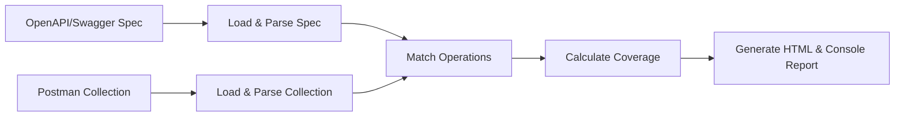

  


# Swagger Coverage CLI

<<<<<<< HEAD
> **A command-line utility to compare your OpenAPI/Swagger specification with a Postman collection and calculate **API test coverage**. Generates a human-readable HTML report.
> Checkut the [Example!](https://dreamquality.github.io/swagger-coverage-cli)**
=======
> **A command-line utility to compare your OpenAPI/Swagger specification with a Postman collection and calculate **API test coverage**. Generates a human-readable HTML report. 
Check out the [Example!](https://dreamquality.github.io/swagger-coverage-cli)**
>>>>>>> 18b37039eaa1b2a84b8aab2cf5271c71698c283c

## Table of Contents

1. [Introduction](#introduction)
2. [Features](#features)
3. [How It Works (Diagram)](#how-it-works-diagram)
4. [Installation & Requirements](#installation--requirements)
5. [Getting Started](#getting-started)

   - [1. Prepare Your Files](#1-prepare-your-files)
   - [2. Run the CLI](#2-run-the-cli)
   - [3. Check the Coverage Report](#3-check-the-coverage-report)

6. [Detailed Matching Logic](#detailed-matching-logic)
7. [Supported File Formats](#supported-file-formats)
8. [Contributing](#contributing)
9. [License](#license)

---

## Introduction

**swagger-coverage-cli** is a tool that helps you **measure how much of your OpenAPI/Swagger-documented API is actually covered by your Postman tests**. It reads two main inputs:

1. An **OpenAPI/Swagger** specification (version 2 or 3) in either JSON or YAML format.
2. A **Postman** collection (JSON) that contains requests and test scripts.

Using this information, the CLI **calculates a coverage percentage** and produces a **detailed HTML report** indicating which endpoints and status codes are validated, and which are missing tests.

---

## Features

- **Easy to Use**: Simple CLI interface with just two main arguments (the Swagger file and the Postman collection).
- **Strict Matching (Optional)**: Enforce strict checks for query parameters, request bodies, and more.
- **HTML Reports**: Generates `coverage-report.html` that shows which endpoints are covered and which are not.
- **Extensible**: Modular code structure (Node.js) allows customization of matching logic, query parameter checks, status code detection, etc.
- **Unit Tested**: Includes Jest tests for the core functions that match endpoints to Postman requests.

---

## How It Works (Diagram)



1. Load & Parse Spec: The CLI reads your Swagger (YAML or JSON) and extracts all documented operations (method, path, status codes, parameters, requestBody details, etc.).
2. Load & Parse Collection: The CLI reads your Postman collection (JSON) to gather all requests, their URLs, methods, test scripts, and any explicitly tested status codes.
3. *Match Operations: The tool compares each documented operation with each Postman request to see if it’s covered (based on path patterns, method, status codes tested, and optional strict checks on parameters and body).
4. Calculate Coverage: It counts how many documented API operations are matched with Postman tests vs. how many total operations are defined in your spec.
5. Generate Report: Prints a summary to the console and creates an HTML file (by default coverage-report.html) with matched and unmatched endpoints.

---

## Installation & Requirements

### Prerequisites

- **Node.js** version 12+ (16+ recommended).
- **NPM** (or Yarn) installed.

### Installation

1. **Clone** or **download** this repository.
2. **Install dependencies** by running:

```bash
npm install -g swagger-coverage-cli


```

---

## Getting Started

### 1. Prepare Your Files

You will need:

1. **OpenAPI/Swagger** specification file (e.g., `openapi.yaml` or `swagger.json`).
2. **Postman** collection file (JSON format), which you can export from the Postman app.

> **Note**: Make sure your Postman collection includes actual test scripts that assert or check specific status codes (e.g., `pm.response.to.have.status(200)`).

### 2. Run the CLI

Use the following command:

```bash
npm swagger-coverage-cli <swaggerFile> <postmanCollection> [options]


```

Example:

```bash
npm swagger-coverage-cli openapi.yaml collection.json --verbose --strict-query --strict-body


```

**Options**:

- `--verbose`: Display additional logs (helpful for debugging).
- `--strict-query`: Enforce strict checks on query parameters (e.g., required params, `enum`, `pattern`, etc.).
- `--strict-body`: Verify that `application/json` request bodies in the spec match raw JSON bodies in Postman requests.
- `--output <file>`: Customize the name of the HTML report file (default is `coverage-report.html`).

### Run via NPM Script

```bash
npm swagger-coverage-cli -- <swaggerFile> <postmanCollection> [options]

```

### 3. Check the Coverage Report

After execution, you will see:

1. **Console Output**:

```bash
=== Swagger Coverage Report ===
Total operations in spec: 12
Matched operations in Postman: 9
Coverage: 75.00%

Unmatched operations:
- [DELETE] /items/{id} (statusCode=204)
- [PUT] /items/{id} (statusCode=400)
...


```

2. **HTML Report**:
   - A file named `coverage-report.html` (or the name you provided with `--output`) is generated.
   - Open it in your browser to see a table of matched/unmatched operations with color highlights.


---

## Detailed Matching Logic

**swagger-coverage-cli** tries to match each **operation** from the spec with a **request** in Postman. An operation is considered **covered** if:

1. **HTTP Method** matches exactly (`GET`, `POST`, `PUT`, `DELETE`, etc.).
2. **Path**:

   - The path pattern from Swagger (e.g., `/users/{id}`) is converted to a regex (like `^/users/[^/]+$`).
   - The Postman request URL (minus any base URL placeholders like `{{baseUrl}}`) must match that regex.

3. **Status Code**:

   - If the spec operation has a specific status code (e.g., `200`, `404`), the CLI checks the Postman test scripts to see if that status code is asserted (e.g., `pm.response.to.have.status(200)`).

4. **Query Parameters** (only if `--strict-query` is enabled):

   - If the spec says a query parameter is required and has certain constraints (e.g., `enum`, `pattern`, `type`), the tool verifies that the Postman request includes that parameter and meets the constraints.

5. **Request Body** (only if `--strict-body` is enabled):

   - If the spec says `requestBody` includes `application/json`, the CLI checks if the Postman request body is raw JSON and can be parsed without errors.

If all criteria are satisfied, the operation is **matched** (covered). Otherwise, it’s reported as **unmatched**.

---

## Supported File Formats

**Swagger/OpenAPI**:

- **JSON** or **YAML**
- **OpenAPI v2 (Swagger 2.0)** or **OpenAPI v3.x**

**Postman**:

- **Postman collection** in **JSON** format (v2.1 or higher recommended).
   - Typically exported via the Postman app: *File → Export → Collection*.

---

## Contributing

Contributions are welcome! Please:

1. **Fork** this repo
2. **Create a branch** for your feature or fix (`git checkout -b feature/something`)
3. **Commit** your changes
4. **Open a Pull Request**

Feel free to add tests in the [`test/`](./test) folder to cover any new logic.

---

## License

This project is licensed under the [MIT License](./LICENSE).

Happy testing! Feel free to open issues or submit pull requests for any improvements.

