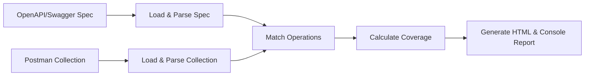

       
 

# Swagger Coverage CLI

> **A comprehensive command-line utility to analyze API test coverage across **multiple protocols**: OpenAPI/Swagger (REST), gRPC Protocol Buffers, and GraphQL schemas. Generates unified HTML reports with protocol-specific insights.**
Check out the [Example!](https://dreamquality.github.io/swagger-coverage-cli)**

## Table of Contents

1. [Introduction](#introduction)
2. [Multi-Protocol Support](#multi-protocol-support)
3. [Features](#features)
4. [How It Works (Diagram)](#how-it-works-diagram)
5. [Installation & Requirements](#installation--requirements)
6. [Getting Started](#getting-started)

   - [1. Prepare Your Files](#1-prepare-your-files)
   - [2. Run the CLI](#2-run-the-cli)
   - [3. Check the Coverage Report](#3-check-the-coverage-report)

7. [Protocol-Specific Usage](#protocol-specific-usage)
8. [Detailed Matching Logic](#detailed-matching-logic)
9. [Smart Endpoint Mapping](#smart-endpoint-mapping)
10. [Supported File Formats](#supported-file-formats)

- [Using CSV for Documentation](#using-csv-for-documentation)

11. [Contributing](#contributing)
12. [License](#license)

---

## Introduction

**swagger-coverage-cli** is a comprehensive tool that helps you **measure API test coverage across multiple protocols**. It analyzes how much of your documented APIs are actually covered by your Postman tests. The tool supports:

### 🚀 Supported API Protocols

- **📋 REST APIs**: OpenAPI/Swagger specifications (v2/v3) in JSON or YAML format
- **⚡ gRPC APIs**: Protocol Buffer (`.proto`) files with service definitions
- **🔀 GraphQL APIs**: GraphQL schema (`.graphql`, `.gql`) files with queries, mutations, and subscriptions
- **📊 CSV APIs**: Custom CSV format for flexible API documentation

### 🎯 Input Sources

1. **API Specifications**: Single or multiple API files in supported formats
2. **Test Collections**: Postman collections (JSON) with requests and test scripts
3. **Execution Reports**: Newman run reports (JSON) with actual test execution results

The tool supports processing **multiple API specifications in a single run**, making it ideal for organizations managing microservices with diverse protocols. It **calculates unified coverage percentages** and produces **detailed HTML reports** with protocol-specific insights.

---

## Multi-Protocol Support

**swagger-coverage-cli** provides comprehensive support for modern API ecosystems with multiple protocols, enabling unified coverage analysis across your entire technology stack.

### 🌐 Universal CLI Interface

```bash
# Single protocol APIs
swagger-coverage-cli api.yaml collection.json           # OpenAPI/REST
swagger-coverage-cli service.proto collection.json     # gRPC
swagger-coverage-cli schema.graphql collection.json    # GraphQL
swagger-coverage-cli api-docs.csv collection.json      # CSV

# Mixed protocol APIs (Enterprise-ready)
swagger-coverage-cli "api.yaml,service.proto,schema.graphql" collection.json

# All existing options work across protocols
swagger-coverage-cli "api.yaml,service.proto" collection.json --verbose --strict-body
```

### 🎯 Protocol-Specific Features

#### 📋 REST/OpenAPI Support
- **OpenAPI v2/v3**: Full specification support
- **Smart Path Matching**: Handles parameter variations (`/users/{id}` vs `/users/{userId}`)
- **Status Code Intelligence**: Prioritizes 2xx → 4xx → 5xx responses
- **Request Body Validation**: JSON schema validation with strict mode

#### ⚡ gRPC Support  
- **Protocol Buffer Parsing**: Automatic `.proto` file analysis
- **Service Discovery**: Extracts all services, methods, and message types
- **Path Generation**: Maps to HTTP/2 paths (`/package.service/method`)
- **Content-Type Validation**: Supports `application/grpc` and variants

#### 🔀 GraphQL Support
- **Schema Analysis**: Parses `.graphql` and `.gql` files
- **Operation Extraction**: Identifies queries, mutations, and subscriptions
- **Type System**: Full support for arguments, unions, and interfaces
- **Endpoint Unification**: Maps all operations to `/graphql` endpoint

### 📊 Unified Reporting

- **Protocol Column**: Color-coded identification (🟢 gRPC, 🔴 GraphQL, 🔵 REST)
- **Mixed Statistics**: Combined coverage metrics across all protocols
- **Individual Breakdown**: Per-API and per-protocol insights
- **Smart Search**: Protocol-aware filtering and search functionality

---

## Features

- **🌐 Multi-Protocol Support**: Native support for REST (OpenAPI/Swagger), gRPC (Protocol Buffers), and GraphQL schemas
- **🔄 Mixed API Analysis**: Process multiple API specifications with different protocols in a single run
- **🎯 Protocol-Aware Matching**: Intelligent request matching tailored to each API protocol's characteristics
- **📊 Unified Reporting**: Generate consolidated HTML reports with protocol-specific insights and color coding
- **⚡ Easy to Use**: Simple CLI interface works across all supported protocols with consistent syntax
- **🔍 Multiple Input Types**: Supports Postman collections and Newman run reports for maximum flexibility
- **🤖 Auto-Detection**: Automatically detects API file types and Newman report formats
- **🏗️ Enterprise Ready**: Perfect for microservices architectures using diverse API protocols
- **🎨 Smart Endpoint Mapping**: Intelligent endpoint matching with status code prioritization and enhanced path matching
- **🔒 Strict Matching (Optional)**: Enforce strict checks for query parameters, request bodies, and more
- **📈 Enhanced HTML Reports**: Generates interactive `coverage-report.html` with protocol identification
- **🧩 Extensible**: Modular code structure allows customization of matching logic and protocol support
- **📋 CSV Support**: Flexible API documentation format for teams preferring spreadsheet-based docs
- **✅ Unit Tested**: Comprehensive Jest test suite covering all protocols and edge cases

---

## How It Works (Diagram)



1. Load & Parse Spec/CSV: The CLI reads your Swagger (YAML or JSON) or CSV file and extracts all documented operations (method, path, status codes, parameters, requestBody details, etc.).
2. Load & Parse Collection: The CLI reads your Postman collection (JSON) to gather all requests, their URLs, methods, test scripts, and any explicitly tested status codes.
3. *Match Operations: The tool compares each documented operation with each Postman request to see if it’s covered (based on path patterns, method, status codes tested, and optional strict checks on parameters and body).
4. Calculate Coverage: It counts how many documented API operations are matched with Postman tests vs. how many total operations are defined in your spec or CSV.
5. Generate Report: Prints a summary to the console and creates an HTML file (by default coverage-report.html) with matched and unmatched endpoints.

---

## Multi-API Support

**swagger-coverage-cli** now supports processing multiple Swagger/OpenAPI specifications in a single run, making it perfect for organizations managing multiple APIs or microservices.

### Usage

To analyze multiple APIs, provide comma-separated file paths:

```bash
swagger-coverage-cli "api1.yaml,api2.yaml,api3.json" collection.json
```

### Features

- **Unified Coverage Report**: Get a single report showing coverage across all APIs
- **API Identification**: Each operation in the report is tagged with its source API
- **Individual API Breakdown**: The report header shows both the combined API list and individual API names
- **Separate Operation Tracking**: Operations with the same path/method from different APIs are tracked separately
- **Backwards Compatibility**: Single API mode works exactly as before

### Example Output

When processing multiple APIs, the console output will show:

```
=== Swagger Coverage Report ===
APIs analyzed: User API, Product API, Order API
Total operations in spec(s): 24
Matched operations in Postman: 18
Coverage: 75.00%

Unmatched Spec operations:
 - [User API] [GET] /users/{id}/profile (statusCode=404)
 - [Product API] [POST] /products (statusCode=400)
 - [Order API] [DELETE] /orders/{id} (statusCode=204)
```

The HTML report will include:
- **API column** in the operations table to identify the source API
- **Combined API information** in the report header
- **Individual API breakdown** for detailed analysis

---

## Installation & Requirements

### Prerequisites

- **Node.js** version 12+ (16+ recommended).
- **NPM** (or Yarn) installed.

### Installation

1. **Clone** or **download** this repository.
2. **Install dependencies** by running:

```bash
npm install -g swagger-coverage-cli


```

---

## Getting Started

### 1. Prepare Your Files

You will need:

1. **OpenAPI/Swagger** specification file (e.g., `openapi.yaml` or `swagger.json`) OR CSV documentation file following the specified format.
2. **Postman** collection file (JSON format), which you can export from the Postman app, **OR** a **Newman run report** (JSON format) generated by running your collection with Newman.

> **Note**: 
> - If using a Postman collection, make sure it includes actual test scripts that assert or check specific status codes (e.g., `pm.response.to.have.status(200)`).
> - If using a Newman report, the tool will extract actual response codes and test results from the execution data.

### 2. Run the CLI

Use the following command:

```bash
npm swagger-coverage-cli <swaggerFile> <postmanCollectionOrNewmanReport> [options]

```

**For Multiple APIs:**

```bash
npm swagger-coverage-cli "api1.yaml,api2.yaml,api3.json" collection.json [options]

```

**Examples:**

**With Postman Collection:**
```bash
npm swagger-coverage-cli openapi.yaml collection.json --verbose --strict-query --strict-body

```

**With Newman Report:**
```bash
npm swagger-coverage-cli openapi.yaml newman-report.json --newman --verbose

```

**Multiple APIs with Newman Report:**
```bash
npm swagger-coverage-cli "users-api.yaml,products-api.yaml" newman-report.json --newman --output multi-api-report.html

```

**Options**:

- `--verbose`: Display additional logs (helpful for debugging).
- `--newman`: Treat input file as Newman run report instead of Postman collection.
- `--strict-query`: Enforce strict checks on query parameters (e.g., required params, `enum`, `pattern`, etc.).
- `--strict-body`: Verify that `application/json` request bodies in the spec match raw JSON bodies in Postman requests.
- `--output <file>`: Customize the name of the HTML report file (default is `coverage-report.html`).

### Run via NPM Script

```bash
npm swagger-coverage-cli -- <swaggerFile> <postmanCollectionOrNewmanReport> [options]


```

### 3. Check the Coverage Report

After execution, you will see:

1. **Console Output**:

```bash
=== Swagger Coverage Report ===
Total operations in spec: 12
Matched operations in Postman: 9
Coverage: 75.00%

Unmatched operations:
- [DELETE] /items/{id} (statusCode=204)
- [PUT] /items/{id} (statusCode=400)
...


```

2. **HTML Report**:
   - A file named `coverage-report.html` (or the name you provided with `--output`) is generated.
   - Open it in your browser to see a table of matched/unmatched operations with color highlights.


---

## Protocol-Specific Usage

### 🌐 OpenAPI/REST APIs

Use standard OpenAPI/Swagger files in YAML or JSON format:

```bash
# Single OpenAPI specification
swagger-coverage-cli api-spec.yaml collection.json

# Multiple REST APIs
swagger-coverage-cli "api-v1.yaml,api-v2.yaml,legacy.json" collection.json

# With strict validation
swagger-coverage-cli openapi.yaml collection.json --strict-query --strict-body
```

**Supported OpenAPI features:**
- Path parameters (`/users/{id}`, `/users/{userId}`)
- Query parameters with schema validation
- Request body validation (JSON, form-data, etc.)
- Multiple response status codes per operation
- OpenAPI v2 and v3 specifications

### ⚡ gRPC APIs

Analyze Protocol Buffer service definitions:

```bash
# Single gRPC service
swagger-coverage-cli user-service.proto collection.json

# Multiple gRPC services
swagger-coverage-cli "user.proto,order.proto,payment.proto" collection.json

# Mixed with OpenAPI
swagger-coverage-cli "rest-api.yaml,grpc-service.proto" collection.json
```

**gRPC-specific features:**
- Service and method extraction from `.proto` files
- HTTP/2 path mapping (`/package.service/method`)
- Content-type validation (`application/grpc`, `application/grpc+proto`)
- Nested package support (`company.api.v1.UserService`)

**Example Postman request for gRPC:**
```json
{
  "method": "POST",
  "url": "{{grpcUrl}}/user.v1.UserService/GetUser",
  "header": [
    { "key": "Content-Type", "value": "application/grpc" }
  ],
  "body": {
    "mode": "raw",
    "raw": "{\"user_id\": \"123\"}"
  }
}
```

### 🔀 GraphQL APIs

Analyze GraphQL schema definitions:

```bash
# Single GraphQL API
swagger-coverage-cli schema.graphql collection.json

# Multiple GraphQL schemas  
swagger-coverage-cli "user-schema.gql,product-schema.graphql" collection.json

# Full stack coverage
swagger-coverage-cli "api.yaml,service.proto,schema.graphql" collection.json
```

**GraphQL-specific features:**
- Query, mutation, and subscription extraction
- Argument analysis with type information
- Union and interface type support
- Nested type relationship mapping

**Example Postman request for GraphQL:**
```json
{
  "method": "POST", 
  "url": "{{apiUrl}}/graphql",
  "header": [
    { "key": "Content-Type", "value": "application/json" }
  ],
  "body": {
    "mode": "raw",
    "raw": "{\"query\": \"query GetUser($id: ID!) { user(id: $id) { id name email } }\", \"variables\": {\"id\": \"123\"}}"
  }
}
```

### 📊 CSV Documentation

Use CSV format for flexible API documentation:

```bash
# CSV-based API documentation
swagger-coverage-cli api-docs.csv collection.json

# Mixed with other formats
swagger-coverage-cli "api.yaml,docs.csv,service.proto" collection.json
```

**CSV format columns:**
- `method`: HTTP method (GET, POST, etc.)
- `path`: API endpoint path
- `statusCode`: Expected response status code
- `description`: Operation description
- `tags`: Comma-separated tags for grouping

### 🏗️ Enterprise Scenarios

**Microservices Architecture:**
```bash
# Complete microservices stack
swagger-coverage-cli "gateway.yaml,user-service.proto,analytics.graphql,docs.csv" tests.json

# Per-team analysis
swagger-coverage-cli "team-a-api.yaml,team-b-service.proto" team-tests.json
```

**CI/CD Integration:**
```bash
# Production coverage check
swagger-coverage-cli "$(find apis -name '*.yaml' -o -name '*.proto' -o -name '*.graphql' | tr '\n' ',')" collection.json --output coverage-$(date +%Y%m%d).html
```

---

## Coverage Calculation Formulas

**swagger-coverage-cli** uses precise mathematical formulas to calculate API test coverage. Understanding these formulas helps you interpret coverage reports and set appropriate coverage targets.

### Basic Coverage Formula

The core coverage calculation is based on the ratio of matched operations to total operations in your API specification:

```
Coverage (%) = (Matched Operations / Total Operations) × 100
```

Where:
- **Total Operations** = Number of unique operation-status code combinations in your API specification
- **Matched Operations** = Number of operations that have corresponding tests in your Postman collection or Newman report

### Operation Matching Criteria

An operation is considered **matched** when ALL of the following criteria are satisfied:

1. **HTTP Method Match**: `specOperation.method === postmanRequest.method`
2. **Path Pattern Match**: Postman URL matches the Swagger path pattern (with parameter substitution)
3. **Status Code Verification**: At least one expected status code from the spec is tested
4. **Query Parameters** (if `--strict-query` enabled): Required parameters are present and valid
5. **Request Body** (if `--strict-body` enabled): JSON body structure matches specification

### Coverage Types

#### Standard Coverage
```
Standard Coverage = Matched Operations / Total Spec Operations × 100
```

#### Postman Collection Coverage
When using Postman collections, coverage is calculated based on:
- Static analysis of test scripts
- Expected status codes extracted from `pm.response.to.have.status(code)` assertions
- Request structure validation

#### Newman Report Coverage (Recommended)
When using Newman reports, coverage calculation includes:
- **Actual execution data** from real test runs
- **Response codes** from executed requests
- **Assertion results** (passed/failed tests)

```
Newman Coverage = (Executed Operations with Passing Tests / Total Spec Operations) × 100
```

### Multi-API Coverage

For multiple API specifications, coverage is calculated as:

```
Combined Coverage = (Sum of Matched Operations across all APIs / Sum of Total Operations across all APIs) × 100
```

Each API operation is identified by: `{API_Name}:{Method}:{Path}:{StatusCode}`

### Tag-Based Coverage

Coverage can also be calculated per tag/group:

```
Tag Coverage = (Matched Operations in Tag / Total Operations in Tag) × 100
```

### Examples

#### Example 1: Single API
- API Specification: 20 operations (GET /users/200, POST /users/201, GET /users/404, etc.)
- Postman Tests: 15 operations covered
- **Coverage**: 15/20 × 100 = **75%**

#### Example 2: Newman vs Postman Collection
- API Specification: 18 operations
- Newman Report: 8 operations with actual execution data
- Postman Collection: 2 operations with static test scripts
- **Newman Coverage**: 8/18 × 100 = **44.44%**
- **Postman Coverage**: 2/18 × 100 = **11.11%**

#### Example 3: Multi-API Portfolio
- User API: 10 operations (7 matched) = 70% coverage
- Product API: 15 operations (12 matched) = 80% coverage
- Order API: 8 operations (5 matched) = 62.5% coverage
- **Combined Coverage**: (7+12+5)/(10+15+8) × 100 = 24/33 × 100 = **72.73%**

### Coverage Quality Metrics

Beyond basic percentage, consider these quality indicators:

1. **Status Code Coverage**: Percentage of documented status codes that are tested
2. **Method Distribution**: Coverage across different HTTP methods (GET, POST, PUT, DELETE)
3. **Critical Path Coverage**: Coverage of business-critical API endpoints
4. **Error Case Coverage**: Percentage of error scenarios (4xx, 5xx) that are tested

### Recommendations

- **Minimum Coverage**: Aim for 80%+ coverage for production APIs
- **Critical Endpoints**: Ensure 100% coverage for authentication, payment, and data modification endpoints
- **Error Testing**: Include at least 50% of documented error cases
- **Use Newman Reports**: For more accurate coverage analysis in CI/CD pipelines

---

## Detailed Matching Logic

**swagger-coverage-cli** tries to match each **operation** from the spec with a **request** in Postman. An operation is considered **covered** if:

1. **HTTP Method** matches exactly (`GET`, `POST`, `PUT`, `DELETE`, etc.).
2. **Path**:

   - The path pattern from Swagger (e.g., `/users/{id}`) is converted to a regex (like `^/users/[^/]+$`).
   - The Postman request URL (minus any base URL placeholders like `{{baseUrl}}`) must match that regex.

3. **Status Code**:

   - If the spec operation has a specific status code (e.g., `200`, `404`), the CLI checks the Postman test scripts to see if that status code is asserted (e.g., `pm.response.to.have.status(200)`).

4. **Query Parameters** (only if `--strict-query` is enabled):

   - If the spec says a query parameter is required and has certain constraints (e.g., `enum`, `pattern`, `type`), the tool verifies that the Postman request includes that parameter and meets the constraints.

5. **Request Body** (only if `--strict-body` is enabled):

   - If the spec says `requestBody` includes `application/json`, the CLI checks if the Postman request body is raw JSON and can be parsed without errors.

If all criteria are satisfied, the operation is **matched** (covered). Otherwise, it’s reported as **unmatched**.

## Smart Endpoint Mapping

**Smart endpoint mapping** is an advanced feature that significantly improves coverage accuracy by using intelligent algorithms to match endpoints. It is **enabled by default** in all operations.

### Key Benefits

- Enhanced path matching for better parameter recognition
- **Status Code Prioritization**: Prioritizes successful (2xx) status codes over error codes
- **Enhanced Path Matching**: Better handling of parameter variations and naming conventions
- **Confidence Scoring**: Assigns quality scores to matches (0.0-1.0)
- **Multi-API Support**: Works seamlessly with microservices and complex architectures

### Quick Start

```bash
# Smart mapping is enabled by default
swagger-coverage-cli api-spec.yaml collection.json --verbose

# Output shows smart mapping statistics:
# Smart mapping: 6 primary matches, 3 secondary matches
# Coverage: 50.00%
```

### Example Use Cases

**Status Code Intelligence:**
```yaml
# API defines multiple status codes
GET /users:
  responses:
    '200': { description: Success }
    '400': { description: Bad Request }
    '500': { description: Server Error }

# Postman only tests success case
pm.test("Status code is 200", function () {
    pm.response.to.have.status(200);
});

# Smart mapping result:
# ✅ Primary Match: GET /users (200) - Matched
# ❌ Secondary: GET /users (400, 500) - Unmatched but deprioritized
```

**Enhanced Path Matching:**
```yaml
# API Spec: /users/{userId}/profile
# Postman:   /users/123/profile
# Result:    ✅ Intelligent parameter matching (confidence: 1.0)
```

### Complete Documentation

For comprehensive examples, use cases, and implementation details, see:
**📖 [Smart Mapping Examples & Use Cases](docs/smart-mapping-examples.md)**

This document covers:
- 25+ detailed examples across 8 categories
- Real-world API scenarios (CRUD, microservices, versioning)
- Edge cases and error handling
- Performance testing and best practices
- CLI integration examples

---
---

## Supported File Formats

**Swagger/OpenAPI/.csv**:

- **JSON** or **YAML**
- **OpenAPI v2 (Swagger 2.0)** or **OpenAPI v3.x**
- **CSV**: API documentation can be provided in CSV format following the specified structure.

**Postman**:

- **Postman collection** in **JSON** format (v2.1 or higher recommended).
   - Typically exported via the Postman app: *File → Export → Collection*.

**Newman Reports**:

- **Newman run report** in **JSON** format.
   - Generated by running: `newman run collection.json --reporters json --reporter-json-export newman-report.json`

### Postman Collection vs Newman Report

The tool supports two types of input for test data:

#### Postman Collection
- **What it is**: The collection definition containing requests and test scripts
- **Pros**: 
  - Contains all test logic and assertions
  - Can extract expected status codes from test scripts
- **Cons**: 
  - No actual execution data
  - Relies on parsing test scripts to understand expected outcomes

#### Newman Report  
- **What it is**: Actual execution results from running a Postman collection with Newman
- **Pros**: 
  - Contains real execution data with actual response codes
  - Includes assertion results (passed/failed)
  - More accurate representation of what was actually tested
  - Includes response times and execution metadata
- **Cons**: 
  - Requires an additional step to generate the report

**Recommendation**: Use Newman reports when possible for more accurate coverage analysis, especially in CI/CD pipelines where collections are actually executed.

### Using CSV for Documentation

In addition to traditional OpenAPI/Swagger specifications, **swagger-coverage-cli** supports API documentation provided in a **CSV** format. This allows for a more flexible and easily editable documentation process, especially for teams that prefer spreadsheet-based documentation.

#### CSV Structure

Your CSV file should adhere to the following structure to ensure compatibility with **swagger-coverage-cli**:

1. **Header Row**: The first row must contain the following columns in **exactly** this order:

```sh
METHOD,URI,NAME,STATUS CODE,BODY,TAGS

```

2. **Data Rows**: Each subsequent row represents an API endpoint response with data corresponding to the headers.

#### Column Descriptions

- **METHOD**

   - **Type:** String
   - **Description:** The HTTP method used for the API endpoint (e.g., `GET`, `POST`, `PUT`, `DELETE`).

- **URI**

   - **Type:** String
   - **Description:** The endpoint's URI path (e.g., `/api/products`).

- **NAME**

   - **Type:** String
   - **Description:** A descriptive name for the API endpoint action (e.g., `getProducts`).

- **STATUS CODE**

   - **Type:** Integer
   - **Description:** The HTTP status code returned by the API (e.g., `200`, `400`).

- **BODY**

   - **Type:** String (JSON format)
   - **Description:** The response body returned by the API in JSON format. Ensure that JSON strings are properly escaped.

- **TAGS**

   - **Type:** String
   - **Description:** Tags associated with the endpoint for categorization and filtering (e.g., `products`).

#### Example CSV

Below is an example of how your `documentation.csv` should be structured:

```csv
METHOD,URI,NAME,STATUS CODE,BODY,TAGS
GET,/api/products,getProducts,200,"{\"products\":\"updated\"}","products"
GET,/api/products,getProducts,400,"{\"error\":\"Invalid query parameters\"}","products"
```
---

## Contributing

Contributions are welcome! Please:

1. **Fork** this repo
2. **Create a branch** for your feature or fix (`git checkout -b feature/something`)
3. **Commit** your changes
4. **Open a Pull Request**

Feel free to add tests in the [`test/`](./test) folder to cover any new logic.

---

## License

This project is licensed under the [MIT License](./LICENSE).

Happy testing! Feel free to open issues or submit pull requests for any improvements.


```

